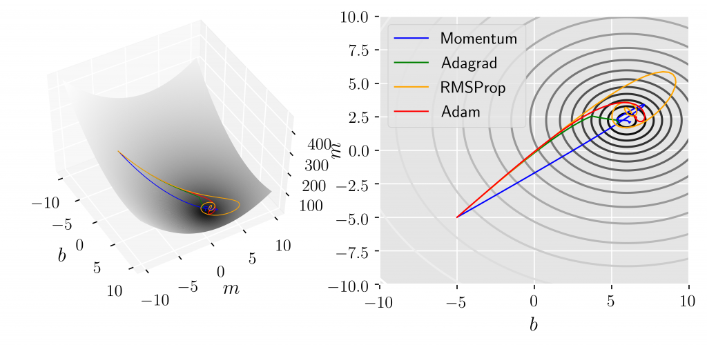

# Improving deep learning neural networks and Hyperparameter Tuning

Getting more training data is not always the answer to improving the accuracy or other evaluation metrics of a deep learning model. Tuning the hyperparameters such as the learning rate, number of layers, number of hidden units etc can also greatly influence how well a model does. Furthermore, algorithms like ADAM (adaptive momentum estimation) and RMS propagation help gradient descent to converge faster and better to a local optima and weight initialization methods like glorot initializers help address the vanishing/exploding gradients problem and thus improve the model. This set of programs deal with the aforementioned algorithms.

